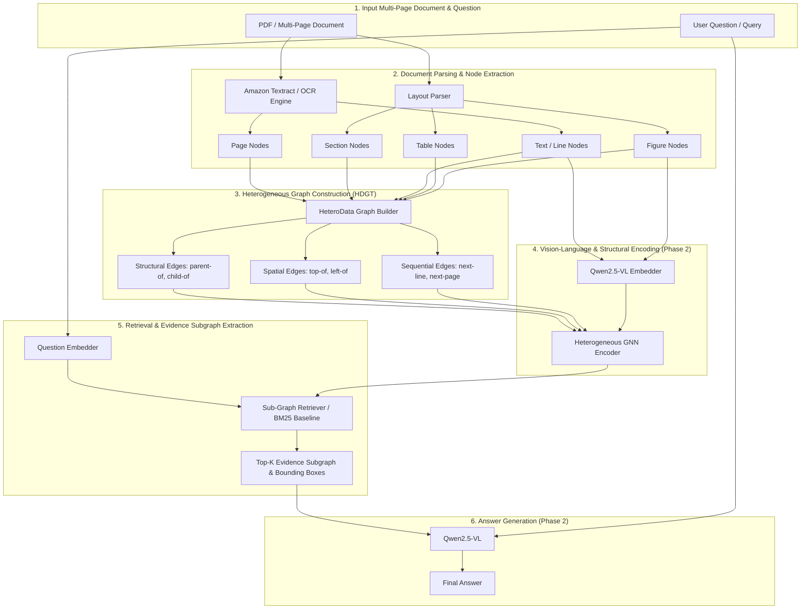

# Heterogeneous Document Graph Transformer (HDGT)
## Technical Report & Guide Presentation for Prof. Shivakumara

---

### 1. Proposed HDGT Framework Architecture

The proposed HDGT framework converts heterogeneous PDF documents into multi-relational graphs preserving visual layout, document hierarchy, and cross-page structural relationships.

---

### 2. MP-DocVQA Dataset Statistics

**Dataset**: MP-DocVQA (Multi-Page Document Visual Question Answering v1.0)

| Benchmark Metric | Full Dataset (Official) | Validation Split (`val`) Evaluated |
| :--- | :---: | :---: |
| **Total Documents** | 5,929 | 1,329 |
| **Total Document Pages** | 47,952 | ~10,600 |
| **Total Questions** | 46,436 | **5,187** |
| **Compiled HDGT Graph Files** | 5,929 | **1,344** |
| **Question Evaluation Coverage** | — | **5,187 / 5,187 (100.0%)** |

---

### 3. Graph Construction Statistics & Taxonomy

Metrics calculated directly from the compiled PyG `HeteroData` graphs in `experiments/mpdocvqa/`.

#### Table 1: Quantitative Graph Totals

| Graph Parameter | Exact Measured Value | Average per Document Graph |
| :--- | :---: | :---: |
| **Total Graph Files** | **1,344** | 1.00 |
| **Total Nodes** | **2,813,088** | **2,093.07** |
| **Total Edges** | **15,734,758** | **11,707.41** |

#### Table 2: Node Type Distribution

| Node Type | Total Count | Description |
| :--- | :---: | :--- |
| `text` | 2,802,567 | Extracted text lines / tokens with bounding boxes |
| `page` | 10,207 | Page boundary nodes representing individual document pages |
| `section` | 197 | Section headers and layout headers |
| `figure` | 72 | Image / figure bounding regions |
| `table` | 45 | Tabular structural nodes |

#### Table 3: Edge Semantics Breakdown

| Edge Category | Exact Edge Count | Description |
| :--- | :---: | :--- |
| `spatial` (`text` $\leftrightarrow$ `text`) | 10,135,908 | 2D bounding-box spatial adjacency (top-of, left-of) |
| `contains` (`page` $\rightarrow$ `node`) | 2,802,567 | Page-to-content containment hierarchy |
| `reading_order` (`text` $\rightarrow$ `text`) | 2,792,294 | Sequential reading order flow |
| `parent_child` (`section` $\rightarrow$ `text`) | 1,430 | Section header hierarchy tree |

---

### 4. Completed Baseline Retrieval Performance

Evaluated over the complete validation split (**5,187 questions**, 0 skipped).

| Retrieval Baseline | Recall@1 | Recall@5 | Recall@10 | MRR | ELA | Evaluated Questions |
| :--- | :---: | :---: | :---: | :---: | :---: | :---: |
| **BM25 Lexical Search** | **59.73%** | **76.96%** | **82.36%** | **0.6701** | **0.0052** | **5,187 / 5,187 (100%)** |

---

### 5. Sample Query & Retrieval Traces

#### 📌 Example 1: Document Header Entity Retrieval
* **Question ID**: `24426` | **Question**: `"What is the name of foundation?"`
* **Ground Truth**: `"The Robert A. Welch Foundation"` (Page 0)
* **Retrieved Top Node**: `Rank 1` (Score: 3.98) $\rightarrow$ `"THE ROBERTA.WELCH FOUNDATION..."`
* **Status**: ✅ **Succeeded at Rank 1** (`Recall@1 = 1.0`, `MRR = 1.00`)

#### 📌 Example 2: Event Program Schedule Query
* **Question ID**: `49168` | **Question**: `"What time is the 'coffee break'?"`
* **Ground Truth**: `"11.14 to 11.39 a.m."` (Page 2)
* **Retrieved Top Node**: `Rank 1` (Score: 2.90) $\rightarrow$ `"| 11:14 to 11:39 a.m. | Coffee Break..."`
* **Status**: ✅ **Succeeded at Rank 1** (`Recall@1 = 1.0`, `MRR = 1.00`)

#### 📌 Example 3: Multi-Page Corporate Report Query
* **Question ID**: `57349` | **Question**: `"What is the name of the company?"`
* **Ground Truth**: `"ITC Limited"` (Page 10)
* **Retrieved Top Nodes**: `Rank 1` (Pg 11 Auditors), `Rank 2` (Pg 1 Paperkraft), `Rank 3` (Pg 10 `"ITC's Brands: An Asset for the Nation"`)
* **Status**: 🟡 **Succeeded at Rank 3** (`Recall@1 = 0.0`, `Recall@5 = 1.0`, `MRR = 0.333`)
