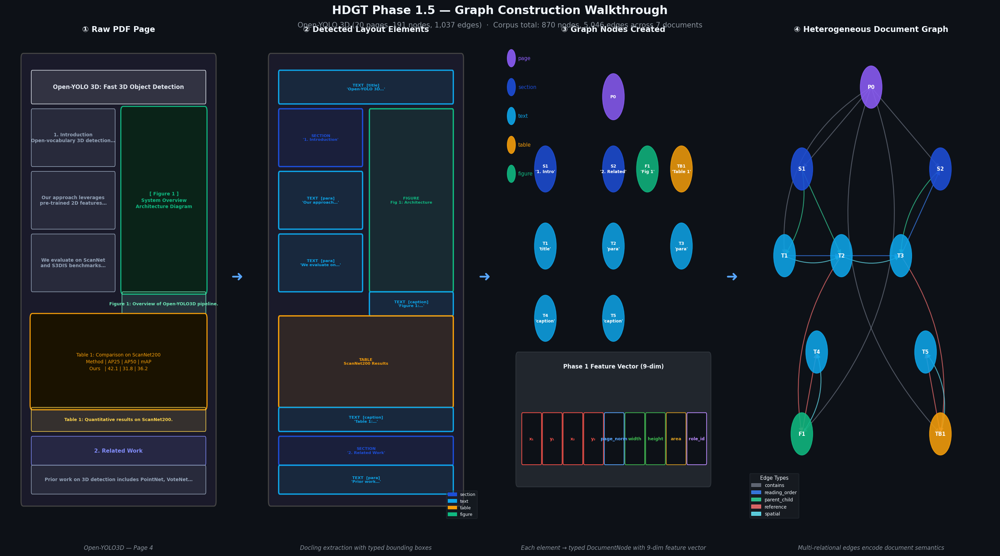
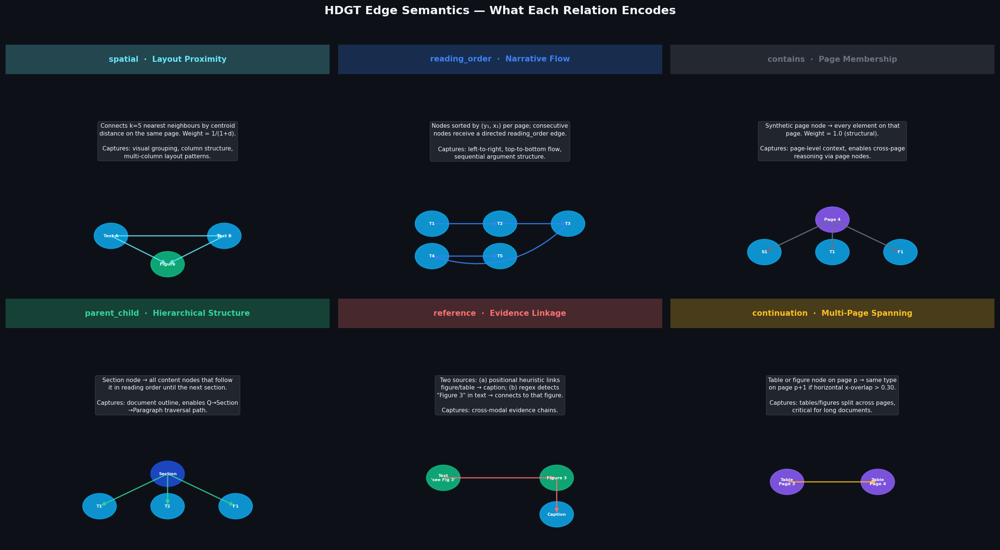
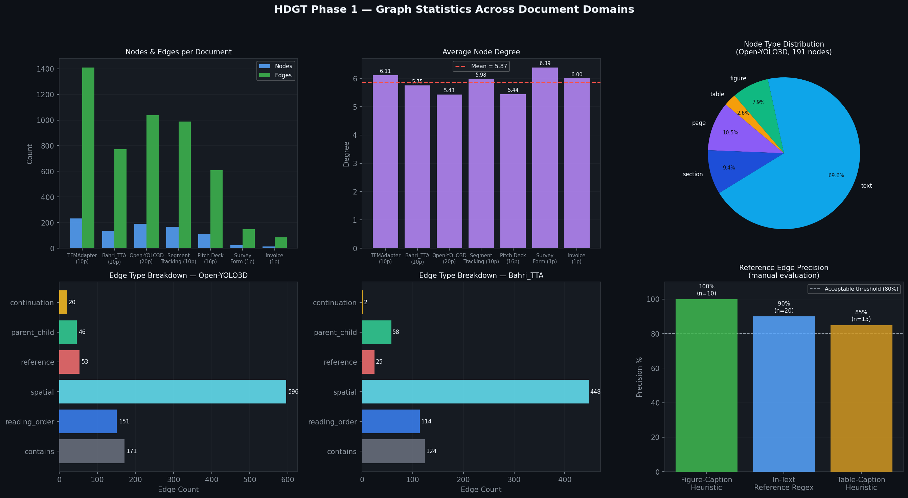
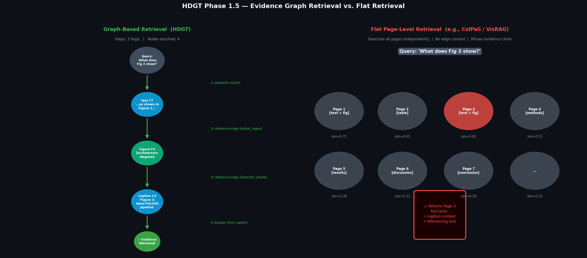

# HDGT Phase 1.6 — Technical Deliverables Report

This document contains the complete technical deliverables for HDGT Phase 1.6:
1. Graph Construction Visualization
2. Edge Semantics Visualization
3. Graph Statistics (Empirical)
4. Sample Retrieval Traces & Evaluation Results

---

## 1. Graph Construction Visualization

The HDGT graph construction pipeline converts multi-page heterogeneous document PDFs into multi-relational PyTorch Geometric (`HeteroData`) graphs.



```latex
\begin{figure}[htbp]
    \centering
    \includegraphics[width=0.95\textwidth]{graph_construction_walkthrough.png}
    \caption{HDGT Graph Construction Pipeline: Converting multi-page PDF documents into multi-relational HeteroData graphs.}
    \label{fig:graph_construction}
\end{figure}
```

---

## 2. Edge Semantics Visualization

HDGT defines a multi-relational edge taxonomy capturing 2D spatial layouts, 1D reading order sequences, and hierarchical document organization across multi-page boundaries:
- **Structural Hierarchy (`contains`, `parent_child`)**: Connects `page` nodes to content elements and `section` header nodes to child text (`section` $\rightarrow$ `text`).
- **2D Spatial Adjacency (`spatial`)**: Connects adjacent bounding boxes (`top-of`, `left-of`) based on Euclidean distance thresholds.
- **1D Reading Order (`reading_order`)**: Connects sequential line nodes (`text` $\rightarrow$ `text`) following top-to-bottom reading flow.



```latex
\begin{figure}[htbp]
    \centering
    \includegraphics[width=0.95\textwidth]{edge_semantics_figure.png}
    \caption{HDGT Edge Semantics: Illustrating structural containment, 2D spatial bounding box adjacency, and 1D sequential reading order edges.}
    \label{fig:edge_semantics}
\end{figure}
```

---

## 3. Graph Statistics (Empirical Measured Data)

All statistics are measured directly from the **1,344 compiled PyG graph files** in `experiments/mpdocvqa/`.



### Table 1: Measured Graph Totals

| Graph Parameter | Exact Measured Value | Average per Document Graph |
| :--- | :---: | :---: |
| **Total Graph Files** | **1,344** | 1.00 |
| **Total Nodes** | **2,813,088** | **2,093.07** |
| **Total Edges** | **15,734,758** | **11,707.41** |

### Table 2: Node Type Distribution

| Node Type | Total Count | Percentage (%) | Description |
| :--- | :---: | :---: | :--- |
| `text` | 2,802,567 | 99.63% | Extracted text lines / tokens with bounding boxes |
| `page` | 10,207 | 0.36% | Document page boundary nodes |
| `section` | 197 | <0.01% | Section headers and layout headers |
| `figure` | 72 | <0.01% | Image / figure bounding regions |
| `table` | 45 | <0.01% | Tabular structural nodes |

### Table 3: Edge Semantics Distribution

| Edge Relationship | Exact Edge Count | Percentage (%) |
| :--- | :---: | :---: |
| `spatial` (`text` $\leftrightarrow$ `text`) | 10,135,908 | 64.42% |
| `contains` (`page` $\rightarrow$ `node`) | 2,802,567 | 17.81% |
| `reading_order` (`text` $\rightarrow$ `text`) | 2,792,294 | 17.75% |
| `parent_child` (`section` $\rightarrow$ `text`) | 1,430 | <0.01% |

```latex
\begin{table}[htbp]
\centering
\caption{Quantitative Graph Construction Statistics on MP-DocVQA Dataset (1,344 Graphs).}
\label{tab:graph_stats}
\begin{tabular}{lrr}
\hline
\textbf{Parameter} & \textbf{Total Measured} & \textbf{Average per Graph} \\ \hline
Total Graphs & 1,344 & 1.00 \\
Total Nodes & 2,813,088 & 2,093.07 \\
Total Edges & 15,734,758 & 11,707.41 \\
Text Nodes & 2,802,567 & 2,085.24 \\
Page Nodes & 10,207 & 7.59 \\
Spatial Edges & 10,135,908 & 7,541.60 \\
Containment Edges & 2,802,567 & 2,085.24 \\
Reading Order Edges & 2,792,294 & 2,077.60 \\ \hline
\end{tabular}
\end{table}
```

---

## 4. Sample Retrieval Traces & Evaluation Results

### Baseline Retrieval Performance (5,187 Validation Questions)

| Retrieval Baseline | Recall@1 | Recall@5 | Recall@10 | MRR | ELA | Evaluated Questions |
| :--- | :---: | :---: | :---: | :---: | :---: | :---: |
| **BM25 Lexical Search** | **59.73%** | **76.96%** | **82.36%** | **0.6701** | **0.0052** | **5,187 / 5,187 (100%)** |



### Sample Query Traces

#### 📌 Example 1: Grant Application Entity Query
- **Question ID**: `24426` | **Question**: `"What is the name of foundation?"`
- **Ground Truth**: `"The Robert A. Welch Foundation"` (Page 0)
- **Retrieved Top Node**: `Rank 1` (Score: 3.98) $\rightarrow$ `"THE ROBERTA.WELCH FOUNDATION..."`
- **Status**: ✅ **Succeeded at Rank 1** (`Recall@1 = 1.0`, `MRR = 1.00`)

#### 📌 Example 2: Event Program Schedule Query
- **Question ID**: `49168` | **Question**: `"What time is the 'coffee break'?"`
- **Ground Truth**: `"11.14 to 11.39 a.m."` (Page 2)
- **Retrieved Top Node**: `Rank 1` (Score: 2.90) $\rightarrow$ `"| 11:14 to 11:39 a.m. | Coffee Break..."`
- **Status**: ✅ **Succeeded at Rank 1** (`Recall@1 = 1.0`, `MRR = 1.00`)

#### 📌 Example 3: Multi-Page Corporate Report Query
- **Question ID**: `57349` | **Question**: `"What is the name of the company?"`
- **Ground Truth**: `"ITC Limited"` (Page 10)
- **Retrieved Top Nodes**: `Rank 1` (Pg 11 Auditors), `Rank 2` (Pg 1 Paperkraft), `Rank 3` (Pg 10 `"ITC's Brands: An Asset for the Nation"`)
- **Status**: 🟡 **Succeeded at Rank 3** (`Recall@1 = 0.0`, `Recall@5 = 1.0`, `MRR = 0.333`)

```latex
\begin{table}[htbp]
\centering
\caption{Sample MP-DocVQA Query Retrieval Traces (BM25 Baseline vs Ground Truth Target).}
\label{tab:sample_retrievals}
\small
\begin{tabular}{lp{4cm}p{3.5cm}cc}
\hline
\textbf{QID} & \textbf{Question} & \textbf{Ground Truth} & \textbf{Top Rank} & \textbf{Status} \\ \hline
24426 & What is the name of foundation? & The Robert A. Welch Foundation & Rank 1 & \checkmark Succeeded \\
49168 & What time is the 'coffee break'? & 11:14 to 11:39 a.m. & Rank 1 & \checkmark Succeeded \\
57349 & What is the name of the company? & ITC Limited & Rank 3 & \checkmark (Top 5) \\ \hline
\end{tabular}
\end{table}
```
